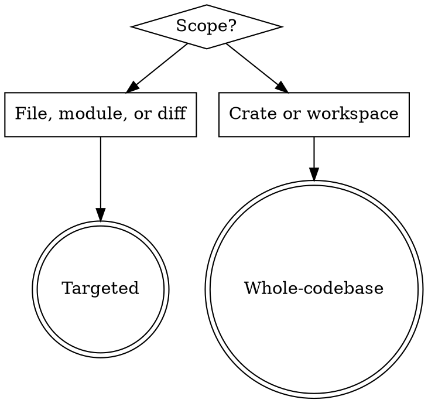

# Rust Guidelines Review

Produces a findings report citing Microsoft's 48 `M-<ID>` Rust guidelines. Report-only — does not fix code. The user may ask for fixes as a follow-up.

## Mode detection

Ambiguous? Ask once, then proceed.

## Pre-flight (both modes)

Detect project type from `Cargo.toml` (`[lib]`, `[[bin]]`, `crate-type`, workspace?) and FFI markers (`#[no_mangle]`, `extern "C"`, `cdylib`/`staticlib`). Filter applicable categories:

| Applies to | Categories added |
|---|---|
| Always | `universal`, `safety`, `performance`, `documentation` |
| Library crates | `library-interop`, `library-ux`, `library-resilience`, `library-building`, `ai` |
| App / binary crates | `applications` |
| Any FFI-bearing crate | `ffi` |

Then load `references/checklist.md` for triage.

## Targeted workflow

1. Pick 2–4 categories the code is likely to touch (e.g., parser → `library-ux` + `universal`; `unsafe` block → `safety`).
2. Load those category reference files (`references/<slug>.md`).
3. Walk the code against each guideline. **Only cite an M-ID after loading its category reference.**
4. Produce the report using `references/report-template.md`.

## Whole-codebase workflow

Dispatch one subagent per applicable category (parallel). Full procedure and subagent prompt template: `references/whole-codebase-workflow.md`.

REQUIRED SUB-SKILL: `superpowers:dispatching-parallel-agents`.

Merge subagent findings into one workspace report (`references/report-template.md`). De-duplicate by `(M-ID, file, line)`. Group by crate, then category; v1.0 before v0.x.

## Report rules

- Cite every finding by `M-<ID>` with a link to the rendered doc (`https://microsoft.github.io/rust-guidelines/guidelines/<path>/M-<ID>.html`). Never invent URLs — if the path is uncertain, link to the upstream repo anchor.
- Show offending snippet + `file:LINE-LINE`.
- Blocking (v1.0) section before Advisory (v0.x).
- Close with the tooling reminder from `references/report-template.md`.

## Red flags — stop and correct

| Thought | Reality |
|---------|---------|
| "I'll cite M-FOO without loading its reference" | Don't. Fabricated IDs are the worst failure mode. Load first, then cite. |
| "Library-style issue in an app — I'll flag it" | Apply the pre-flight filter. Library rules don't bind application internals. |
| "0.x is close enough to 1.0, mark it blocking" | No. v0.x is advisory — Microsoft's own signal. |
| "I'll fix the violations while I'm here" | No. Report only. Fixes require a follow-up request. |
| "Can't tell if this applies from the code alone" | Put it in "Out of scope / uncheckable". Don't invent findings. |
| "I'll skip the checklist and go deep" | Load `checklist.md` first. Triage before deep-dive. |

## Not in scope

- Fixing code. Report only.
- Replacing `cargo clippy` / `cargo fmt` / `cargo audit` / `miri`. Reference `M-STATIC-VERIFICATION` in the tooling section; don't reimplement lints.
- Writing `Cargo.toml` lint configuration. If `M-STATIC-VERIFICATION` isn't configured, flag it as a finding; don't write the config yourself.

## Provenance

Source: microsoft/rust-guidelines at the SHA recorded in `references/UPSTREAM.md`. Refresh procedure in that file.
